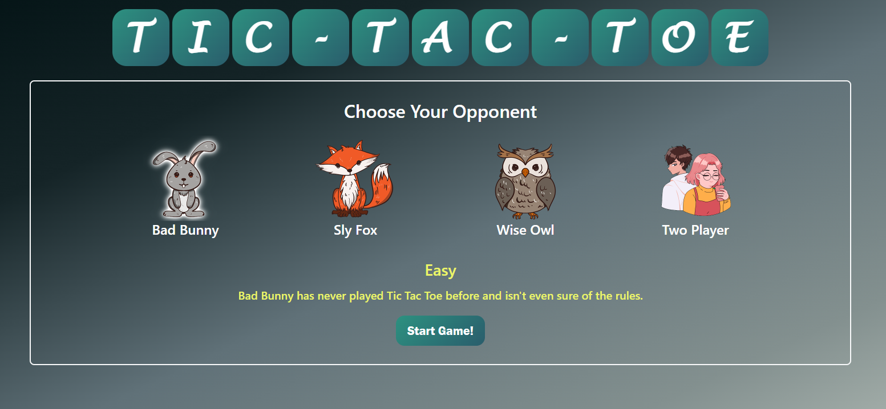
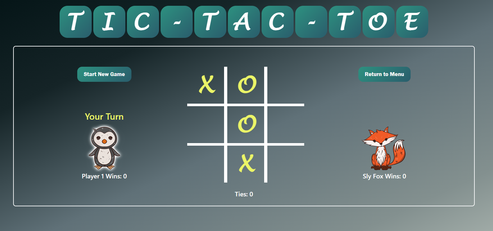

# Tic Tac Toe application

Tic Tac Toe game with 3 different AI levels, two player functionality, and mobile optimization. Built with React and hosted with Vercel.



## Installation & Setup

1. Fork and clone repo.

2. Install dependencies.

  ```sh
   npm i
   ```

3. Start development server.

 ```sh
   npm start
   ```



## AI Functionality

### Easy Mode (Bad Bunny)
Easy mode opponent will find all empty squares and choose one at random, without any strategy for winnng the game or preventing the player from winning.

### Medium Mode (Sly Fox)
Medium mode opponent can spot winning moves and either play them or block them as needed, but will otherwise play randomly until winning moves are available.

### Impossible Mode (Wise Owl)
Impossible Mode opponent uses a maximizing/minimizing function to always play the best available move.

